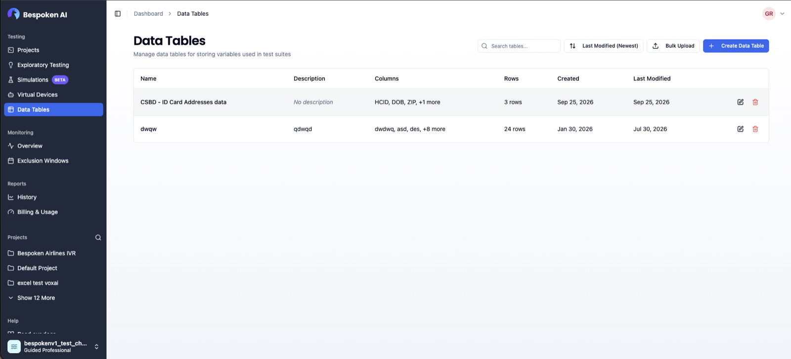

Many tests start the same way. They log in, enter an account number, or confirm a date of birth before they reach the part you actually want to test. Until now you copied those steps into every test, and when the IVR changed, you fixed each copy by hand.

**Shared Steps let you write that flow once and reuse it everywhere.**

## Build a library of reusable steps

Open **Shared Steps** from the sidebar to create one. Give it a name, a short description, and the platform it's for, then add steps the same way you do in a test. You can edit them in the visual editor or in YAML.

## Insert one into any test

In the test editor, open the **Add Step** menu, pick **Add Shared Step**, and choose from your library. It shows up as a single card you can expand to see each step inside. Step numbers keep counting through it, so results still line up with what you wrote.

When you edit a Shared Step, every test that uses it runs the new version. There's nothing to copy or update.

## Variables

A Shared Step can use variables, like `{{account_number}}`, so the same flow works with different data. If a variable has no default value, the dashboard asks for it when you insert the step.

## Clear results

During a run, each step inside a Shared Step shows its own response and assertions, just like a normal step. If a Shared Step can't be loaded, the run stops before calling and tells you why.
